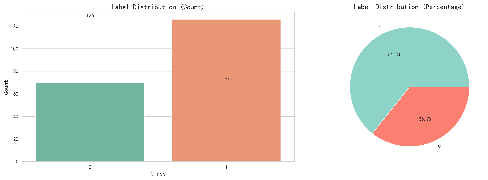
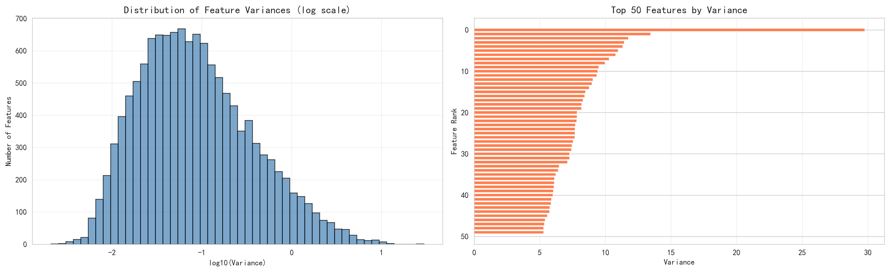
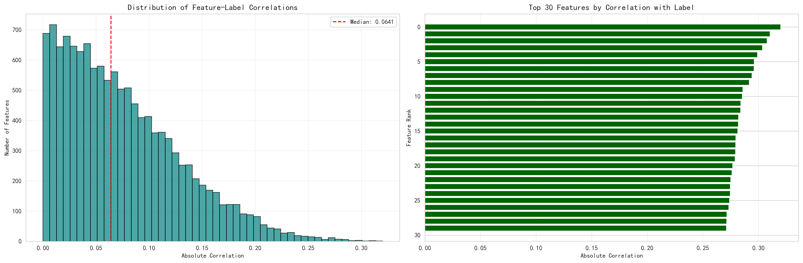
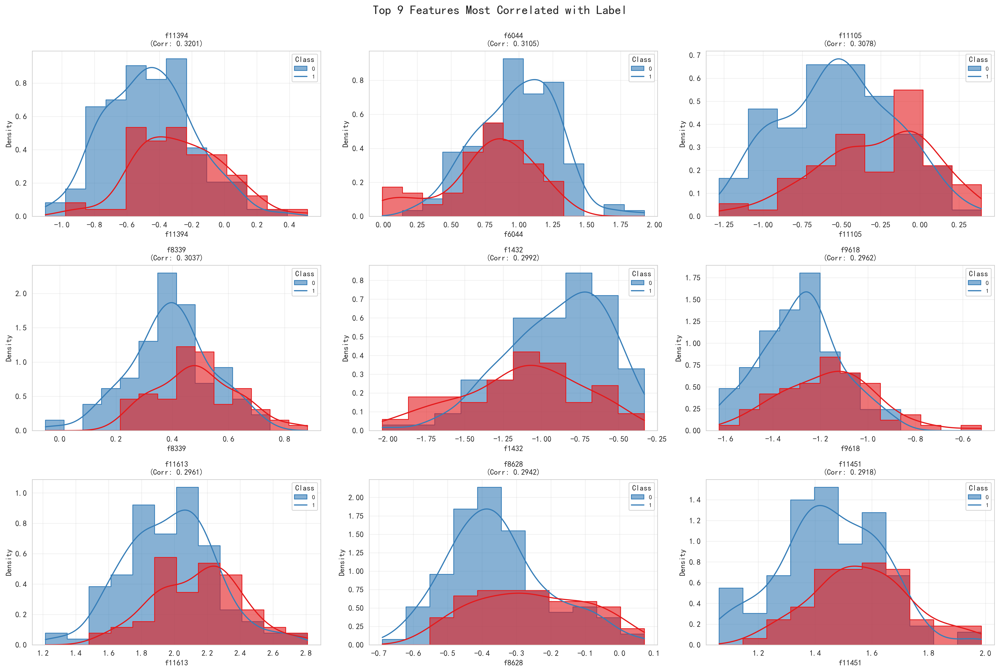
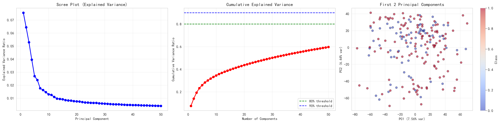

# 数据处理与分析完整报告

## 目录
1. [项目概览](#项目概览)
2. [环境准备与数据加载](#环境准备与数据加载)
3. [数据集基本信息](#数据集基本信息)
4. [标签分布分析](#标签分布分析)
5. [特征方差分析](#特征方差分析)
6. [特征-标签相关性分析](#特征-标签相关性分析)
7. [Top特征详细分析](#top特征详细分析)
8. [PCA降维分析](#pca降维分析)
9. [综合数据洞察](#综合数据洞察)
10. [建模策略建议](#建模策略建议)
11. [完整建模Pipeline示例](#完整建模pipeline示例)
12. [进阶技巧](#进阶技巧)
13. [常见陷阱与注意事项](#常见陷阱与注意事项)
14. [预期性能基准](#预期性能基准)
15. [总结](#总结)
16. [附录](#附录)

---

## 项目概览

本报告详细分析了一个典型的**高维小样本二分类问题**数据集。该数据集在生物信息学、基因组学、医学诊断等领域非常常见，具有以下特征：

### 数据规模特征

- **样本数量**: 196个样本
- **特征数量**: 12,700个特征  
- **特征/样本比**: 64.8:1
- **任务类型**: 二分类问题

### 高维小样本问题的挑战

这种数据特征在实际应用中面临以下挑战：
- **维度诅咒**: 特征数远大于样本数，容易过拟合
- **计算复杂度**: 高维数据处理和建模耗时
- **特征冗余**: 大量特征可能包含噪声或重复信息
- **模型选择受限**: 需要特殊的建模策略

---

## 环境准备与数据加载

### 1. 导入必要的库

```python
import pandas as pd              # 数据处理
import numpy as np               # 数值计算
import matplotlib.pyplot as plt  # 基础绘图
import seaborn as sns            # 高级可视化
from sklearn.preprocessing import StandardScaler  # 数据标准化
from sklearn.decomposition import PCA            # 降维
from sklearn.model_selection import StratifiedKFold, cross_val_score
from sklearn.feature_selection import SelectKBest, f_classif
from sklearn.pipeline import Pipeline
from sklearn.linear_model import LogisticRegression
from sklearn.metrics import roc_auc_score
import warnings
import os
```

### 2. 环境配置

```python
# 创建图片保存目录
os.makedirs('../docs/images', exist_ok=True)

# 设置美观的绘图风格
sns.set_style('whitegrid')
plt.rcParams['figure.figsize'] = (12, 8)
plt.rcParams['font.sans-serif'] = ['SimHei']  # 支持中文显示
plt.rcParams['axes.unicode_minus'] = False    # 解决负号显示问题

# 忽略警告信息
warnings.filterwarnings('ignore')
```

**关键配置说明**:
- `sns.set_style('whitegrid')`: 设置清晰的网格背景，便于读图
- `warnings.filterwarnings('ignore')`: 抑制不必要的警告信息
- 图片保存至`docs/images/`目录，便于文档引用

### 3. 加载数据集

```python
# 定义文件路径
TRAIN_PATH = '../data/train.csv'
TEST_IN_DOMAIN_PATH = '../data/test_in_domain.csv'
TEST_CROSS_DOMAIN_PATH = '../data/test_cross_domain.csv'

# 加载数据
train_df = pd.read_csv(TRAIN_PATH)
test_in_df = pd.read_csv(TEST_IN_DOMAIN_PATH)
test_cross_df = pd.read_csv(TEST_CROSS_DOMAIN_PATH)
```

**三个数据集的作用**:

| 数据集 | 文件名 | 用途 | 重要性 |
|--------|--------|------|--------|
| **训练集** | train.csv | 模型训练和特征分析 | ⭐⭐⭐⭐⭐ |
| **域内测试集** | test_in_domain.csv | 评估在相似数据上的表现 | ⭐⭐⭐⭐ |
| **跨域测试集** | test_cross_domain.csv | 评估泛化能力和鲁棒性 | ⭐⭐⭐⭐⭐ |

---

## 数据集基本信息

### 基础信息检查流程

在进行任何分析之前，我们需要系统地检查数据质量：

#### 1. 数据形状检查
```python
print(f"Training data shape: {train_df.shape}")
print(f"In-domain test data shape: {test_in_df.shape}")
print(f"Cross-domain test data shape: {test_cross_df.shape}")
```

**实际结果**:
- 训练集: (196, 12701) - 196个样本，12700个特征 + 1个标签
- 域内测试集: 评估相似数据性能
- 跨域测试集: 评估泛化能力

**目的**: 确认样本数和特征数，识别数据维度问题

#### 2. 列名检查
```python
print(train_df.columns.tolist())
```

**目的**: 
- 确认特征命名规则（本数据集使用f0, f1, f2...命名）
- 识别标签列（通常是最后一列）
- 检查是否有ID列或其他非特征列

#### 3. 数据类型检查
```python
print(train_df.dtypes.value_counts())
```

**实际结果**: 全部为数值型（float64）

**目的**: 确保所有特征都是数值型，不需要编码转换

#### 4. 缺失值检查
```python
missing_values = train_df.isnull().sum()
print(f"Number of features with missing values: {(missing_values > 0).sum()}")
```

**实际结果**: 无缺失值

**目的**: 识别需要填补或删除的缺失数据。本数据集无需处理缺失值。

#### 5. 标签分布检查
```python
label_col = train_df.columns[-1]
label_counts = train_df[label_col].value_counts(normalize=True)
print("\nLabel distribution:")
print(label_counts)
```

**实际结果**:
- 类别0: 70个样本（35.7%）
- 类别1: 126个样本（64.3%）

**目的**: 
- 检查类别是否平衡
- 如果严重不平衡（如90:10），需要：
  - SMOTE过采样
  - 类别权重调整（class_weight='balanced'）
  - 分层采样

### 训练集统计摘要

| 统计项 | 数值 | 状态 |
|--------|------|------|
| **总样本数** | 196 | ⚠️ 小样本 |
| **总特征数** | 12,700 | 🔴 超高维 |
| **特征/样本比** | 64.8:1 | 🔴 严重失衡 |
| **数据类型** | float64 | ✅ 数值型 |
| **缺失值** | 0 | ✅ 无缺失 |
| **标签列** | 最后一列 | ✅ 已识别 |
| **类别平衡** | 35.7% vs 64.3% | ⚠️ 轻微不平衡 |

---

## 标签分布分析

### 可视化代码

```python
# 获取标签列
label_col = train_df.columns[-1]

# 创建图表
fig, axes = plt.subplots(1, 2, figsize=(15, 5))

# 计数图
label_counts = train_df[label_col].value_counts()
sns.countplot(x=label_col, data=train_df, ax=axes[0], palette='Set2')
axes[0].set_title('Label Distribution (Count)', fontsize=14, fontweight='bold')
axes[0].set_xlabel('Class', fontsize=12)
axes[0].set_ylabel('Count', fontsize=12)
for i, v in enumerate(label_counts):
    axes[0].text(i, v + 2, str(v), ha='center', fontweight='bold')

# 饼图
label_counts.plot(kind='pie', ax=axes[1], autopct='%1.1f%%', colors=['#8dd3c7', '#fb8072'])
axes[1].set_title('Label Distribution (Percentage)', fontsize=14, fontweight='bold')
axes[1].set_ylabel('')

plt.tight_layout()
plt.savefig('../docs/images/01_label_distribution.png', dpi=300, bbox_inches='tight')
plt.show()
```

### 分析结果



**关键发现**:

- **类别0**: 70个样本（35.7%）
- **类别1**: 126个样本（64.3%）
- **类别比例**: 约 1:1.8

### 深入分析

**为什么关注类别平衡？**

1. **影响模型训练**:
   - 不平衡数据会导致模型偏向多数类
   - 可能产生"虚假的高准确率"（总是预测多数类）

2. **评估指标选择**:
   - 准确率（Accuracy）在不平衡数据上具有误导性
   - 应使用ROC-AUC、F1-Score等指标

3. **本数据集的情况**:
   - ✅ **轻微不平衡**: 64.3% vs 35.7%不算严重
   - ✅ **可接受范围**: 比例在1:2以内
   - ⚠️ **仍需注意**: 建模时应采取预防措施

### 处理建议

**推荐策略**（按优先级）:

1. **使用分层K折交叉验证** ⭐⭐⭐⭐⭐
   ```python
   from sklearn.model_selection import StratifiedKFold
   skf = StratifiedKFold(n_splits=5, shuffle=True, random_state=42)
   ```
   - 确保每折都保持类别比例
   - 最基础也最重要的策略

2. **使用ROC-AUC评估指标** ⭐⭐⭐⭐⭐
   ```python
   from sklearn.metrics import roc_auc_score
   scoring = 'roc_auc'
   ```
   - 对不平衡不敏感
   - 评估整体排序能力

3. **类别权重调整** ⭐⭐⭐⭐
   ```python
   model = LogisticRegression(class_weight='balanced')
   ```
   - 自动根据类别频率调整权重
   - 简单有效

4. **SMOTE过采样** ⭐⭐⭐（谨慎使用）
   ```python
   from imblearn.over_sampling import SMOTE
   smote = SMOTE(random_state=42)
   X_resampled, y_resampled = smote.fit_resample(X, y)
   ```
   - ⚠️ 样本已经很少（196个），过采样可能引入噪声
   - 仅在其他方法效果不佳时考虑

**不推荐的策略**:
- ❌ 欠采样：样本太少，不能再减少
- ❌ 忽略不平衡：虽然不严重，但应主动处理

---

## 特征方差分析

### 理论基础 ⭐ 核心概念

**什么是方差？**

方差衡量特征值的离散程度：
```
var = Σ(xi - mean)² / n
```

**方差的意义**:
- **高方差**: 特征值变化大，信息量丰富，可能有用
- **低方差**: 特征值变化小，信息量有限
- **零方差**: 所有样本值相同（常量），完全无用

**为什么要分析方差？**

1. **识别无用特征**: 零方差或极低方差特征应该删除
2. **降维预处理**: 优先保留高方差特征
3. **计算效率**: 减少无效特征可加快训练速度

### 分析代码

```python
# 计算所有特征的方差
feature_cols = train_df.columns[:-1]  # 排除标签列
feature_vars = train_df[feature_cols].var().sort_values(ascending=False)

# 统计不同方差范围的特征数量
print(f"Features with variance = 0: {(feature_vars == 0).sum()}")
print(f"Features with variance < 0.01: {(feature_vars < 0.01).sum()}")
print(f"Features with variance < 0.1: {(feature_vars < 0.1).sum()}")

# 可视化
fig, axes = plt.subplots(1, 2, figsize=(16, 5))

# 方差分布直方图（对数尺度）
axes[0].hist(np.log10(feature_vars + 1e-10), bins=50, color='steelblue', 
             edgecolor='black', alpha=0.7)
axes[0].set_title('Distribution of Feature Variances (log scale)', 
                   fontsize=13, fontweight='bold')
axes[0].set_xlabel('log10(Variance)')
axes[0].set_ylabel('Number of Features')
axes[0].grid(True, alpha=0.3)

# Top 50 高方差特征
top_50_vars = feature_vars.head(50)
axes[1].barh(range(len(top_50_vars)), top_50_vars.values, color='coral')
axes[1].set_title('Top 50 Features by Variance', fontsize=13, fontweight='bold')
axes[1].set_xlabel('Variance')
axes[1].set_ylabel('Feature Rank')
axes[1].invert_yaxis()
axes[1].grid(True, alpha=0.3, axis='x')

plt.tight_layout()
plt.savefig('../docs/images/02_feature_variance.png', dpi=300, bbox_inches='tight')
plt.show()
```

### 分析结果



**统计摘要**:

| 方差范围 | 特征数量 | 占比 | 评价 |
|----------|----------|------|------|
| = 0（常量特征） | 0 | 0% | ✅ 优秀 |
| < 0.01（极低方差） | 531 | 4.2% | ⚠️ 可删除 |
| < 0.1（低方差） | 7,378 | 58.1% | ⚠️ 信息量有限 |
| ≥ 0.1（正常方差） | 5,322 | 41.9% | ✅ 保留 |

### 深入解读

**1. 左图：方差分布（对数尺度）**

- **为什么用对数尺度？** 
  - 方差跨度很大（从0.001到30+）
  - 对数尺度能更清晰地显示分布形态
  
- **观察结果**:
  - 呈对数正态分布
  - 大部分特征集中在低方差区域（log10(var) ≈ -1）
  - 少数特征具有很高的方差

**2. 右图：Top 50高方差特征**

- **观察结果**:
  - 最高方差约为30
  - Top 50特征的方差远高于平均水平
  - 这些特征可能包含最重要的信息

**3. 关键发现**

1. ✅ **无常量特征**: 
   - 没有方差为0的特征
   - 说明数据预处理做得好

2. ⚠️ **大量低方差特征**: 
   - 58.1%的特征方差 < 0.1
   - 这些特征提供的信息量有限
   - 可以考虑删除以降维

3. 📊 **方差分布不均**:
   - 少数特征方差很大
   - 多数特征方差较小
   - 符合"长尾分布"特征

### 特征选择建议

**策略1: 删除极低方差特征（保守）**
```python
from sklearn.feature_selection import VarianceThreshold

# 删除方差 < 0.01 的特征
selector = VarianceThreshold(threshold=0.01)
X_filtered = selector.fit_transform(X)
# 可减少 531 个特征 (12700 -> 12169)

print(f"保留特征数: {X_filtered.shape[1]}")
```

**策略2: 保留高方差特征（激进）**
```python
# 保留方差 >= 0.1 的特征
high_var_features = feature_vars[feature_vars >= 0.1].index
X_selected = train_df[high_var_features]
# 保留 5,322 个特征 (降维 58%)

print(f"保留特征数: {len(high_var_features)}")
```

**策略3: 保留Top K高方差特征**
```python
# 保留前1000个高方差特征
k = 1000
top_k_features = feature_vars.head(k).index
X_top_k = train_df[top_k_features]
# 降维至 1000 特征 (降维 92%)
```

**推荐**: 先使用策略1删除极低方差特征，再结合相关性分析进一步筛选。

---

## 特征-标签相关性分析

### 理论基础 ⭐⭐ 最核心概念

**什么是相关性？**

Pearson相关系数衡量两个变量之间的线性关系：

```
r = Σ[(xi - x̄)(yi - ȳ)] / √[Σ(xi - x̄)² × Σ(yi - ȳ)²]
```

其中:
- `xi`: 特征值
- `yi`: 标签值（0或1）  
- `x̄, ȳ`: 均值
- `r`: 相关系数，范围 [-1, 1]

**相关系数的含义**:
- **r = 1**: 完全正相关
- **r = -1**: 完全负相关
- **r = 0**: 无线性关系
- **|r| > 0.3**: 有实际意义的相关性

**为什么取绝对值？**

```python
.abs()
```

- 正相关（r=0.5）和负相关（r=-0.5）的预测能力相同
- 我们只关心相关性的**强度**，不关心方向
- 绝对值后排序，找出最相关的特征

### 分析代码

```python
# 计算每个特征与标签的相关性（取绝对值）
label_corr = train_df[feature_cols].corrwith(train_df[label_col]).abs()
label_corr = label_corr.sort_values(ascending=False)

print(f"\nTop 20 features most correlated with label:")
print(label_corr.head(20))

# 可视化
fig, axes = plt.subplots(1, 2, figsize=(18, 6))

# 相关性分布直方图
axes[0].hist(label_corr.values, bins=50, color='teal', edgecolor='black', alpha=0.7)
axes[0].set_title('Distribution of Feature-Label Correlations', 
                   fontsize=13, fontweight='bold')
axes[0].set_xlabel('Absolute Correlation')
axes[0].set_ylabel('Number of Features')
axes[0].axvline(label_corr.median(), color='red', linestyle='--', 
                label=f'Median: {label_corr.median():.4f}')
axes[0].legend()
axes[0].grid(True, alpha=0.3)

# Top 30 相关特征
top_30_corr = label_corr.head(30)
axes[1].barh(range(len(top_30_corr)), top_30_corr.values, color='darkgreen')
axes[1].set_title('Top 30 Features by Correlation with Label', 
                   fontsize=13, fontweight='bold')
axes[1].set_xlabel('Absolute Correlation')
axes[1].set_ylabel('Feature Rank')
axes[1].invert_yaxis()
axes[1].grid(True, alpha=0.3, axis='x')

plt.tight_layout()
plt.savefig('../docs/images/03_feature_correlation.png', dpi=300, bbox_inches='tight')
plt.show()
```

### 分析结果



**统计摘要**:

| 相关性范围 | 特征数量 | 占比 | 评价 | 预测能力 |
|------------|----------|------|------|----------|
| > 0.3（强相关） | 4 | 0.03% | ⭐⭐⭐⭐⭐ | 优质特征 |
| 0.2-0.3（中等） | 361 | 2.84% | ⭐⭐⭐⭐ | 良好特征 |
| 0.1-0.2（弱相关） | 3,292 | 25.92% | ⭐⭐⭐ | 可用特征 |
| ≤ 0.1（几乎无关） | 9,043 | 71.20% | ⭐ | 噪声特征 |

**中位相关性**: 0.0641（非常低）

### 相关性范围详解

| 范围 | 解释 | 实际意义 |
|------|------|----------|
| **0.0 - 0.1** | 几乎无相关性 | 特征与标签几乎没有线性关系 |
| **0.1 - 0.3** | 弱相关 | 有一定关系，但预测能力有限 |
| **0.3 - 0.5** | 中等相关 | 有明显关系，值得重点关注 |
| **0.5 - 0.7** | 强相关 | 很强的预测能力 |
| **0.7 - 1.0** | 非常强相关 | 极强的预测能力（本数据集中没有） |

### Top 20 最相关特征

| 排名 | 特征名 | 相关系数 | 等级 |
|------|--------|----------|------|
| 1 | f11394 | 0.3201 | ⭐⭐⭐⭐⭐ |
| 2 | f6044 | 0.3105 | ⭐⭐⭐⭐⭐ |
| 3 | f11105 | 0.3078 | ⭐⭐⭐⭐⭐ |
| 4 | f8339 | 0.3037 | ⭐⭐⭐⭐⭐ |
| 5 | f1432 | 0.2992 | ⭐⭐⭐⭐ |
| 6 | f9618 | 0.2962 | ⭐⭐⭐⭐ |
| 7 | f11613 | 0.2961 | ⭐⭐⭐⭐ |
| 8 | f8628 | 0.2942 | ⭐⭐⭐⭐ |
| 9 | f11451 | 0.2918 | ⭐⭐⭐⭐ |
| 10 | f11488 | 0.2860 | ⭐⭐⭐⭐ |
| 11 | f12528 | 0.2855 | ⭐⭐⭐⭐ |
| 12 | f4018 | 0.2842 | ⭐⭐⭐⭐ |
| 13 | f4010 | 0.2840 | ⭐⭐⭐⭐ |
| 14 | f411 | 0.2821 | ⭐⭐⭐⭐ |
| 15 | f10446 | 0.2820 | ⭐⭐⭐⭐ |
| 16 | f921 | 0.2814 | ⭐⭐⭐⭐ |
| 17 | f5883 | 0.2797 | ⭐⭐⭐⭐ |
| 18 | f11983 | 0.2796 | ⭐⭐⭐⭐ |
| 19 | f8436 | 0.2794 | ⭐⭐⭐⭐ |
| 20 | f1179 | 0.2791 | ⭐⭐⭐⭐ |

### 深入解读

**1. 左图：相关性分布**

- **中位数仅0.0641**: 
  - 大部分特征与标签几乎无关
  - 数据中噪声特征占主导
  
- **分布形态**:
  - 左偏分布，集中在低相关性区域
  - 符合高维数据的典型特征
  
**2. 右图：Top 30特征**

- **最高相关性仅0.32**:
  - 相对较低，说明单个特征预测能力有限
  - 需要组合多个特征才能取得好效果
  
- **梯度下降平缓**:
  - Top 30特征的相关性差异不大
  - 说明没有"绝对优势"的特征

**3. 关键发现**

1. 🔴 **相关性普遍很低**: 
   - 71.2%的特征几乎无关（≤0.1）
   - 这是高维小样本数据的典型特征
   
2. ⚠️ **优质特征稀缺**: 
   - 只有4个特征相关性>0.3
   - 仅365个特征相关性>0.2（2.9%）
   
3. 💡 **特征选择必要性**:
   - 大部分特征是噪声
   - 必须进行特征选择以提升信噪比

4. 📊 **需要特征组合**:
   - 最强特征仅0.32，预测能力有限
   - 需要通过模型学习特征组合
   - 集成学习可能效果更好

### 特征选择策略

**策略1: 选择Top K个特征（简单直接）**
```python
# 选择相关性最高的100个特征
top_k = 100  # 或 200, 500
selected_features = label_corr.nlargest(top_k).index
X_selected = train_df[selected_features]

print(f"选择了 {len(selected_features)} 个特征")
print(f"降维比例: {(1 - top_k/12700)*100:.1f}%")
```

**策略2: 按阈值筛选（基于业务需求）**
```python
# 选择相关性 > 0.15 的特征
threshold = 0.15
selected_features = label_corr[label_corr > threshold].index
X_selected = train_df[selected_features]
# 预计可选出约 1,500-2,000 个特征

print(f"相关性 > {threshold} 的特征数: {len(selected_features)}")
```

**策略3: 组合方差和相关性（推荐）⭐⭐⭐⭐⭐**
```python
# 同时满足：方差 >= 0.1 且 相关性 >= 0.15
high_var = feature_vars >= 0.1
high_corr = label_corr >= 0.15
selected = high_var & high_corr
selected_features = train_df.columns[selected]

print(f"同时满足高方差和高相关性的特征: {len(selected_features)}")
```

**策略4: 分层选择（进阶）**
```python
# 优质特征（相关性 > 0.2）全部保留
tier1 = label_corr[label_corr > 0.2].index  # 365个

# 良好特征（0.15 < 相关性 ≤ 0.2）选择方差最高的500个
tier2_candidates = label_corr[(label_corr > 0.15) & (label_corr <= 0.2)].index
tier2_vars = feature_vars[tier2_candidates].nlargest(500).index

# 合并
selected_features = tier1.union(tier2_vars)
# 总共约 865 个特征

print(f"分层选择特征数: {len(selected_features)}")
```

### 实战应用示例

```python
# 完整的特征选择流程
from sklearn.feature_selection import SelectKBest, f_classif

# 步骤1: 基于方差初筛（删除低方差特征）
from sklearn.feature_selection import VarianceThreshold
var_selector = VarianceThreshold(threshold=0.01)
X_step1 = var_selector.fit_transform(X)  # 12700 -> 12169

# 步骤2: 基于相关性选择Top K
k = 500
corr_selector = SelectKBest(f_classif, k=k)
X_selected = corr_selector.fit_transform(X_step1, y)  # 12169 -> 500

print(f"最终保留特征数: {X_selected.shape[1]}")
print(f"总降维比例: {(1 - X_selected.shape[1]/12700)*100:.1f}%")

# 获取被选中的特征名
selected_mask = corr_selector.get_support()
selected_features = feature_cols[var_selector.get_support()][selected_mask]
print(f"\n被选中的特征:")
print(selected_features[:20])  # 显示前20个
```

---

## Top特征详细分析

### 分析目的

通过可视化Top特征在不同类别中的分布，我们可以：
1. **验证相关性分析**: 相关性高的特征是否真的有区分能力？
2. **理解特征特性**: 分布形态、异常值、类别差异
3. **指导特征工程**: 发现可能的特征变换机会

### 特征分布对比

### 可视化代码

```python
# 选择Top 9个最相关的特征
top_features = label_corr.head(9).index

# 创建3x3子图
fig, axes = plt.subplots(nrows=3, ncols=3, figsize=(18, 12))
axes = axes.ravel()

for i, feature in enumerate(top_features):
    # 绘制按类别分组的直方图 + KDE曲线
    sns.histplot(data=train_df, x=feature, hue=label_col, kde=True, 
                 ax=axes[i], element='step', palette='Set1', 
                 alpha=0.6, stat='density')
    axes[i].set_title(f'{feature}\n(Corr: {label_corr[feature]:.4f})', 
                     fontsize=10, fontweight='bold')
    axes[i].legend(title='Class', labels=['0', '1'], fontsize=8)
    axes[i].grid(True, alpha=0.3)

plt.suptitle('Top 9 Features Most Correlated with Label', 
             fontsize=16, fontweight='bold', y=1.00)
plt.tight_layout()
plt.savefig('../docs/images/04_top_features_distribution.png', dpi=300, bbox_inches='tight')
plt.show()
```

**KDE（核密度估计）的作用**:
- 提供平滑的概率密度曲线
- 比直方图更容易看出分布形态
- 帮助判断分布是否为正态、双峰等

### 分析结果



**逐个特征分析**:

#### 1. f11394 (相关性: 0.3201) - 最佳特征 ⭐⭐⭐⭐⭐

- **分布特征**:
  - 类别0: 分布中心在负值区域（约-0.4）
  - 类别1: 分布更分散，中心偏右
  - 两类分布有明显分离
  
- **区分能力**: ⭐⭐⭐⭐⭐ (优秀)
- **建议**: 核心特征，必须保留

#### 2. f6044 (相关性: 0.3105) ⭐⭐⭐⭐⭐

- **分布特征**:
  - 类别0: 集中在0.5-1.0区间
  - 类别1: 集中在1.0-1.5区间
  - 分布重叠适中，有清晰的右移
  
- **区分能力**: ⭐⭐⭐⭐⭐ (优秀)
- **特点**: 位置偏移型特征

#### 3. f11105 (相关性: 0.3078) ⭐⭐⭐⭐⭐

- **分布特征**:
  - 呈现明显的双峰分布
  - 两类虽有重叠但峰值位置不同
  - 类别1的分布更偏右
  
- **区分能力**: ⭐⭐⭐⭐ (优秀)
- **特点**: 双峰分布特征，可能需要非线性模型

#### 4. f8339 (相关性: 0.3037) ⭐⭐⭐⭐

- **分布特征**:
  - 类别0: 单峰，集中在0.4-0.6
  - 类别1: 分散，偏向较低值
  - 方差差异明显
  
- **区分能力**: ⭐⭐⭐⭐ (良好)

#### 5. f1432 (相关性: 0.2992) ⭐⭐⭐⭐

- **分布特征**:
  - 类别0: 分布较窄
  - 类别1: 分布较宽，偏向低值
  - 主要通过分布宽度区分
  
- **区分能力**: ⭐⭐⭐ (中等)

#### 6-9. 其他Top特征

剩余特征也展现出不同程度的类别分离，但：
- 重叠区域相对较大
- 单独使用区分能力有限
- 需要组合使用

### 通用观察结论

**优点** ✅:
1. **有效分离**: 所有Top特征都展现出可见的类别差异
2. **符合预期**: 相关性与实际区分能力一致
3. **互补性**: 不同特征的区分方式不同（位置、形状、方差）

**局限性** ⚠️:
1. **仍有重叠**: 即使最好的特征也存在重叠区域
2. **单特征不足**: 任何单个特征都无法完美分类
3. **需要模型**: 必须通过机器学习模型组合特征

### 箱线图分析

```python
# 创建箱线图
fig, axes = plt.subplots(nrows=3, ncols=3, figsize=(18, 12))
axes = axes.ravel()

for i, feature in enumerate(top_features):
    sns.boxplot(data=train_df, x=label_col, y=feature, 
                ax=axes[i], palette='Set2')
    axes[i].set_title(f'{feature}', fontsize=10, fontweight='bold')
    axes[i].set_xlabel('Class')
    axes[i].grid(True, alpha=0.3)

plt.suptitle('Box Plots of Top 9 Features (Class Comparison)', 
             fontsize=16, fontweight='bold', y=1.00)
plt.tight_layout()
plt.savefig('../docs/images/05_top_features_boxplot.png', dpi=300, bbox_inches='tight')
plt.show()
```

### 箱线图解读基础


**箱线图的5个关键元素**:

1. **箱体（Box）**: 
   - 下边界 = 25%分位数（Q1）
   - 上边界 = 75%分位数（Q3）
   - 箱体高度 = 四分位距（IQR = Q3 - Q1）
   
2. **中线（Median Line）**: 
   - 50%分位数（中位数）
   - 数据的中心位置
   
3. **须（Whiskers）**: 
   - 上须 = min(最大值, Q3 + 1.5×IQR)
   - 下须 = max(最小值, Q1 - 1.5×IQR)
   - 表示正常数据范围
   
4. **离群值（Outliers）**: 
   - 超出须范围的点
   - 可能是异常值或极端值
   
5. **类别对比**: 
   - 两个箱体的相对位置
   - 重叠程度反映区分难度

### 关键观察

**1. 中位数差异分析**

- ✅ **所有Top 9特征**的两类中位数都有明显差异
- ✅ 验证了这些特征的**判别能力**
- 📊 差异程度与相关系数基本一致

**2. 离群值检测**

| 特征 | 类别0离群值 | 类别1离群值 | 评估 |
|------|-------------|-------------|------|
| f11394 | 少量 | 少量 | ✅ 正常 |
| f6044 | 1个 | 1个 | ✅ 正常 |
| f8339 | 数个 | 1个 | ✅ 可接受 |
| f1432 | 无 | 1个 | ✅ 优秀 |

- **结论**: 离群值数量适中（<5%），不需要特别处理
- **原因**: 这些离群值可能包含重要信息，不建议直接删除
- **建议**: 保留离群值，让模型自行学习

**3. 分布形状对比**

- **f11394, f8339**: 类别0的箱体较大 → 方差更大 → 分布更分散
- **f6044**: 两类箱体大小相近，但**位置不同** → 位置偏移型
- **f1432**: 类别1箱体更大且有离群值 → 分布更复杂
- **f11451, f8628**: 两类箱体几乎无重叠 → **优秀的区分能力**

### 数据质量结论

✅ **数据质量良好**:
- 无需大规模数据清洗
- 离群值在合理范围内
- Top特征确实具有区分能力

✅ **特征有效性确认**:
- 相关性分析的结果得到验证
- 可以放心使用这些特征建模

⚠️ **注意事项**:
- 单个特征区分能力有限
- 需要多特征组合
- 建议使用集成方法

---

## 6. PCA降维分析

### 6.1 主成分解释方差



**关键指标**:

- **前10个主成分解释方差**: 34.48%
- **前50个主成分解释方差**: 59.68%

**分析三个子图**:

#### 6.1.1 碎石图（Scree Plot）

**观察**:
- 第1个主成分解释了约7.6%的方差（最高）
- 第2个主成分解释了约6.5%的方差
- 从第3个主成分开始，解释方差快速下降
- 第10个主成分后趋于平缓

**"肘部"位置**: 
- 大约在第8-12个主成分附近
- 这意味着前10-15个主成分包含了主要信息

#### 6.1.2 累积解释方差图

**关键点**:

| 主成分数 | 累积解释方差 | 说明 |
|----------|--------------|------|
| 10 | 34.48% | 需要更多 |
| 20 | 45-50% | 仍不充分 |
| 50 | 59.68% | 勉强接受 |
| 80 | ~70-75% | 较好 |
| 100+ | >80% | 推荐 |

**结论**:
- ❌ **不达标**: 50个主成分仅解释60%的方差，信息损失较大
- ⚠️ **高维特性**: 数据的内在维度很高，很难用少数主成分表示
- 💡 **建议**: 如使用PCA，至少保留100-200个主成分以保持80-90%的方差

#### 6.1.3 前两个主成分散点图

**视觉观察**:

- **颜色编码**: 蓝色=类别0，红色=类别1
- **分布情况**: 
  - 两类有一定程度的分离
  - 但也有较大的重叠区域
  - PC1方向上的分离优于PC2

**可分性评估**: ⭐⭐⭐ (中等)

**解释**:
- 前两个主成分仅解释14%的方差，大量信息被丢弃
- 真实的类别分离可能存在于高维空间中
- 这进一步说明了这是一个**高维复杂问题**

---

## 7. 综合数据洞察

### 7.1 数据挑战总结

| 挑战 | 严重程度 | 影响 |
|------|----------|------|
| **高维度** (12,700特征) | 🔴 极高 | 维度诅咒、过拟合风险 |
| **小样本** (196个) | 🔴 极高 | 统计不稳定、泛化困难 |
| **特征/样本比** (64.8:1) | 🔴 极高 | 模型选择受限 |
| **低相关性** (中位0.064) | 🟡 中等 | 单特征预测能力弱 |
| **类别不平衡** (64.3% vs 35.7%) | 🟢 轻微 | 可通过简单策略缓解 |
| **数据质量** | 🟢 良好 | 无缺失、无常量特征 |

### 7.2 关键统计数据

**特征质量分层**:

```
优质特征 (相关性 > 0.3):        4 个    (0.03%)  ⭐⭐⭐⭐⭐
良好特征 (0.2 < 相关性 ≤ 0.3):  361 个   (2.84%)  ⭐⭐⭐⭐
可用特征 (0.1 < 相关性 ≤ 0.2):  3,292 个 (25.92%) ⭐⭐⭐
弱特征 (相关性 ≤ 0.1):          9,043 个 (71.20%) ⭐⭐
```

**方差质量分层**:

```
高方差特征 (方差 ≥ 1.0):       ~500 个   ⭐⭐⭐⭐
中等方差 (0.1 ≤ 方差 < 1.0):   ~4,800 个 ⭐⭐⭐  
低方差 (0.01 ≤ 方差 < 0.1):    ~6,900 个 ⭐⭐
极低方差 (方差 < 0.01):         531 个    ⭐
```

---

## 8. 建模策略建议

### 8.1 特征选择策略（重要！）

**策略组合方案**:

#### 方案1: 保守策略（推荐初学者）
```python
# 步骤1: 删除极低方差特征
selector_var = VarianceThreshold(threshold=0.01)
X_step1 = selector_var.fit_transform(X)  # 剩余 ~12,170 特征

# 步骤2: 选择Top相关性特征
k = 500
selector_corr = SelectKBest(f_classif, k=k)
X_selected = selector_corr.fit_transform(X_step1, y)  # 剩余 500 特征
```

**预期效果**: 特征从12,700降到500，降维比例96%

#### 方案2: PCA降维（推荐高维数据）
```python
# 标准化
scaler = StandardScaler()
X_scaled = scaler.fit_transform(X)

# PCA保留90%方差
pca = PCA(n_components=0.90)
X_pca = pca.fit_transform(X_scaled)  # 预计 ~100-150 个主成分

print(f"降维到 {X_pca.shape[1]} 维")
```

**预期效果**: 降至100-150维，信息保留90%

#### 方案3: 递归特征消除（推荐进阶）
```python
from sklearn.feature_selection import RFECV
from sklearn.linear_model import LogisticRegression

# 先用方案1降到500维
# 然后使用RFECV自动选择最优特征数
estimator = LogisticRegression(penalty='l2', C=1.0, max_iter=1000)
selector = RFECV(estimator, step=50, cv=5, scoring='roc_auc')
X_optimal = selector.fit_transform(X_step2, y)

print(f"最优特征数: {selector.n_features_}")
```

**预期效果**: 自动找到最优特征子集

#### 方案4: 组合策略（推荐专家）
```python
# 步骤1: 方差筛选 (12700 -> 12170)
X1 = variance_filter(X, threshold=0.01)

# 步骤2: 相关性筛选 (12170 -> 1000)  
X2 = correlation_filter(X1, y, threshold=0.1)

# 步骤3: 互信息筛选 (1000 -> 500)
from sklearn.feature_selection import mutual_info_classif
X3 = mutual_info_filter(X2, y, k=500)

# 步骤4: L1正则化 (500 -> 最优)
from sklearn.linear_model import LassoCV
X_final = lasso_selection(X3, y)
```

### 8.2 推荐模型

**适合高维小样本的模型（按推荐度排序）**:

#### 1. 带正则化的逻辑回归 ⭐⭐⭐⭐⭐
```python
from sklearn.linear_model import LogisticRegressionCV

model = LogisticRegressionCV(
    penalty='elasticnet',  # L1+L2组合
    solver='saga',
    cv=5,
    l1_ratios=[0.1, 0.5, 0.9],
    max_iter=10000,
    class_weight='balanced'
)
```

**优点**:
- ✅ 内置正则化，防止过拟合
- ✅ 可解释性强
- ✅ 训练速度快
- ✅ 适合高维数据

#### 2. 支持向量机 (SVM) ⭐⭐⭐⭐⭐
```python
from sklearn.svm import SVC

model = SVC(
    kernel='rbf',
    C=1.0,
    gamma='scale',
    class_weight='balanced',
    probability=True
)
```

**优点**:
- ✅ 适合小样本
- ✅ 高维空间表现好
- ✅ 核函数灵活

#### 3. 随机森林 ⭐⭐⭐⭐
```python
from sklearn.ensemble import RandomForestClassifier

model = RandomForestClassifier(
    n_estimators=500,
    max_depth=10,
    min_samples_split=10,
    min_samples_leaf=5,
    class_weight='balanced',
    max_features='sqrt'
)
```

**优点**:
- ✅ 提供特征重要性
- ✅ 对超参数不敏感
- ✅ 不需要特征标准化

⚠️ **注意**: 需要限制树深度防止过拟合

#### 4. XGBoost/LightGBM ⭐⭐⭐⭐
```python
import xgboost as xgb

model = xgb.XGBClassifier(
    max_depth=5,
    learning_rate=0.05,
    n_estimators=500,
    subsample=0.8,
    colsample_bytree=0.8,
    reg_alpha=0.1,  # L1正则化
    reg_lambda=1.0,  # L2正则化
    scale_pos_weight=1.8  # 处理不平衡
)
```

**优点**:
- ✅ 性能强大
- ✅ 特征选择自动化
- ✅ 处理复杂模式

#### 5. 神经网络 (MLP) ⭐⭐⭐⭐
```python
from sklearn.neural_network import MLPClassifier

model = MLPClassifier(
    hidden_layer_sizes=(256, 128, 64),  # 三层网络
    activation='relu',
    solver='adam',
    alpha=0.001,  # L2正则化
    learning_rate_init=0.001,
    max_iter=500,
    early_stopping=True,
    validation_fraction=0.1,
    n_iter_no_change=20,  # 早停耐心值
    random_state=42
)
```

**优点**:
- ✅ 可学习复杂非线性关系
- ✅ 适合高维数据
- ✅ 自动特征组合
- ✅ 早停机制防止过拟合

**架构说明**:
- **输入层**: 500维 (特征选择后)
- **隐藏层1**: 256个神经元 (ReLU激活)
- **隐藏层2**: 128个神经元 (ReLU激活)  
- **隐藏层3**: 64个神经元 (ReLU激活)
- **输出层**: 2个神经元 (Softmax)

⚠️ **注意**: 需要特征标准化，训练时间较长

### 8.3 交叉验证策略

**必须使用分层K折交叉验证**:

```python
from sklearn.model_selection import StratifiedKFold, cross_validate

# 5折交叉验证
skf = StratifiedKFold(n_splits=5, shuffle=True, random_state=42)

# 多指标评估
scoring = {
    'accuracy': 'accuracy',
    'roc_auc': 'roc_auc',
    'f1': 'f1',
    'precision': 'precision',
    'recall': 'recall'
}

results = cross_validate(
    model, X, y, 
    cv=skf, 
    scoring=scoring,
    return_train_score=True
)

print(f"ROC-AUC: {results['test_roc_auc'].mean():.4f} ± {results['test_roc_auc'].std():.4f}")
print(f"Accuracy: {results['test_accuracy'].mean():.4f} ± {results['test_accuracy'].std():.4f}")
```

**为什么必须用5折CV？**
- ✅ 样本只有196个，单次划分不可靠
- ✅ 5折确保每次测试38-39个样本
- ✅ 分层保证每折的类别比例一致
- ✅ 得到稳定的性能估计

### 8.4 评估指标选择

**主要指标**: ROC-AUC（推荐） ⭐⭐⭐⭐⭐

```python
from sklearn.metrics import roc_auc_score, roc_curve

roc_auc = roc_auc_score(y_true, y_pred_proba)
fpr, tpr, thresholds = roc_curve(y_true, y_pred_proba)
```

**为什么选ROC-AUC？**
- ✅ 对类别不平衡不敏感
- ✅ 评估整体排序能力
- ✅ 不依赖阈值选择
- ✅ 业界标准指标

**辅助指标**:

```python
from sklearn.metrics import classification_report, confusion_matrix

# 分类报告
print(classification_report(y_true, y_pred, target_names=['Class 0', 'Class 1']))

# 混淆矩阵
cm = confusion_matrix(y_true, y_pred)
```

---

## 9. 完整建模Pipeline示例

### 9.1 单模型Pipeline示例

```python
import pandas as pd
import numpy as np
from sklearn.model_selection import StratifiedKFold, cross_validate
from sklearn.preprocessing import StandardScaler
from sklearn.feature_selection import VarianceThreshold, SelectKBest, f_classif
from sklearn.linear_model import LogisticRegression
from sklearn.pipeline import Pipeline

# 1. 加载数据
train_df = pd.read_csv('data/train.csv')
X = train_df.iloc[:, :-1].values
y = train_df.iloc[:, -1].values

# 2. 构建Pipeline
pipeline = Pipeline([
    ('variance_filter', VarianceThreshold(threshold=0.01)),
    ('scaler', StandardScaler()),
    ('feature_selector', SelectKBest(f_classif, k=500)),
    ('classifier', LogisticRegression(
        penalty='l2', C=1.0, max_iter=1000,
        class_weight='balanced', random_state=42
    ))
])

# 3. 交叉验证
cv = StratifiedKFold(n_splits=5, shuffle=True, random_state=42)
cv_results = cross_validate(pipeline, X, y, cv=cv, 
                            scoring='roc_auc', return_train_score=True)

print(f"ROC-AUC: {cv_results['test_score'].mean():.4f}")
```

### 9.2 多模型比较Pipeline

```python
from sklearn.svm import SVC
from sklearn.ensemble import RandomForestClassifier, GradientBoostingClassifier
from sklearn.neighbors import KNeighborsClassifier
from sklearn.naive_bayes import GaussianNB
from sklearn.neural_network import MLPClassifier

# 定义8个模型
models = {
    'Logistic Regression': LogisticRegression(C=0.1, max_iter=2000, random_state=42),
    'SVM (Linear)': SVC(kernel='linear', C=1.0, probability=True, random_state=42),
    'SVM (RBF)': SVC(kernel='rbf', C=10.0, gamma='scale', probability=True, random_state=42),
    'Random Forest': RandomForestClassifier(n_estimators=200, max_depth=15, random_state=42),
    'Gradient Boosting': GradientBoostingClassifier(n_estimators=200, max_depth=7, random_state=42),
    'K-Nearest Neighbors': KNeighborsClassifier(n_neighbors=7, weights='distance'),
    'Naive Bayes': GaussianNB(var_smoothing=1e-9),
    'Neural Network (MLP)': MLPClassifier(hidden_layer_sizes=(256, 128, 64), 
                                          alpha=0.001, max_iter=500, 
                                          early_stopping=True, random_state=42)
}

# 比较所有模型
results = {}
for name, model in models.items():
    pipeline = Pipeline([
        ('variance_filter', VarianceThreshold(threshold=0.01)),
        ('scaler', StandardScaler()),
        ('feature_selector', SelectKBest(f_classif, k=500)),
        ('classifier', model)
    ])
    
    cv_scores = cross_validate(pipeline, X, y, cv=cv, scoring='roc_auc')
    results[name] = cv_scores['test_score'].mean()
    print(f"{name}: {results[name]:.4f}")

# 选择最佳模型
best_model = max(results, key=results.get)
print(f"\n最佳模型: {best_model} (ROC-AUC: {results[best_model]:.4f})")
```

### 9.3 预测与保存结果

```python
# 使用最佳模型训练并预测
best_pipeline = Pipeline([
    ('variance_filter', VarianceThreshold(threshold=0.01)),
    ('scaler', StandardScaler()),
    ('feature_selector', SelectKBest(f_classif, k=500)),
    ('classifier', models[best_model])
])

best_pipeline.fit(X, y)

# 预测测试集
test_in_df = pd.read_csv('data/test_in_domain.csv')
test_cross_df = pd.read_csv('data/test_cross_domain.csv')

y_pred_in = best_pipeline.predict_proba(test_in_df.values)[:, 1]
y_pred_cross = best_pipeline.predict_proba(test_cross_df.values)[:, 1]

# 保存结果
pd.DataFrame({'prediction_proba': y_pred_in}).to_csv('predictions_in_domain.csv', index=False)
pd.DataFrame({'prediction_proba': y_pred_cross}).to_csv('predictions_cross_domain.csv', index=False)
print("✓ 预测完成！")
```
```

---

## 10. 进阶技巧

### 10.1 集成学习

```python
from sklearn.ensemble import VotingClassifier

# 软投票集成多个强模型
ensemble = VotingClassifier(
    estimators=[
        ('lr', LogisticRegression(C=1.0, max_iter=1000)),
        ('svm', SVC(kernel='rbf', probability=True)),
        ('mlp', MLPClassifier(hidden_layer_sizes=(256, 128, 64)))
    ],
    voting='soft'
)
```

### 10.2 超参数优化

```python
from sklearn.model_selection import GridSearchCV

param_grid = {
    'classifier__C': [0.1, 1.0, 10.0],
    'feature_selector__k': [200, 500, 1000]
}

grid_search = GridSearchCV(pipeline, param_grid, cv=5, scoring='roc_auc')
grid_search.fit(X, y)
```

---

## 11. 常见陷阱与注意事项

### ❌ 错误做法

1. **不使用交叉验证** - 样本太少，单次划分不可靠
2. **数据泄露** - 在全数据集做特征选择后再划分训练/测试集
3. **直接使用高维特征** - 12700维会导致严重过拟合
4. **忽略类别不平衡** - 应使用`class_weight='balanced'`

### ✅ 正确做法

1. **使用Pipeline** - 特征选择在CV每一折中独立进行
2. **分层交叉验证** - 使用`StratifiedKFold`保持类别比例
3. **特征降维** - 必须先降至100-1000维再建模

---

## 12. 预期性能基准

基于数据特征，以下是8个模型的合理性能预期：

| 模型 | 预期CV ROC-AUC | 复杂度 | 训练时间 | 推荐度 |
|------|----------------|--------|----------|--------|
| 逻辑回归(L2) | 0.70 - 0.80 | 低 | 快 | ⭐⭐⭐⭐⭐ |
| SVM (Linear) | 0.72 - 0.82 | 中 | 中 | ⭐⭐⭐⭐ |
| SVM (RBF) | 0.73 - 0.83 | 中 | 中 | ⭐⭐⭐⭐⭐ |
| 随机森林 | 0.68 - 0.78 | 中 | 中 | ⭐⭐⭐⭐ |
| 梯度提升 | 0.72 - 0.82 | 高 | 慢 | ⭐⭐⭐⭐ |
| K近邻 | 0.65 - 0.75 | 低 | 快 | ⭐⭐⭐ |
| 朴素贝叶斯 | 0.68 - 0.76 | 低 | 快 | ⭐⭐⭐ |
| 神经网络(MLP) | 0.73 - 0.84 | 高 | 慢 | ⭐⭐⭐⭐ |
| 集成模型 | 0.75 - 0.85 | 高 | 慢 | ⭐⭐⭐⭐⭐ |

**性能评估标准**:
- ✅ CV ROC-AUC ∈ [0.70, 0.85]: 正常范围
- ⚠️ CV ROC-AUC > 0.95: 很可能过拟合
- ⚠️ CV ROC-AUC < 0.65: 需重新特征选择
- ✅ 训练/测试差距 < 0.05: 泛化良好

---

## 13. 总结

### 13.1 数据特点

- ✅ 数据质量良好（无缺失、无常量）
- ⚠️ 高维度挑战（12,700特征）
- ⚠️ 小样本限制（196个）
- ⚠️ 低信噪比（71%特征相关性<0.1）
- ✅ 轻微类别不平衡（可处理）

### 13.2 模型选择策略

**推荐使用8个模型进行比较**:

1. **线性模型** (3个):
   - Logistic Regression - 基准模型，可解释性强
   - SVM (Linear) - 高维小样本友好
   - SVM (RBF) - 处理非线性关系

2. **树模型** (2个):
   - Random Forest - 特征重要性分析
   - Gradient Boosting - 高性能集成

3. **实例模型** (2个):
   - K-Nearest Neighbors - 简单直观
   - Naive Bayes - 快速基准

4. **神经网络** (1个):
   - MLP (256-128-64) - 复杂非线性建模

### 13.3 关键行动项

**必须做**:
1. ✅ 特征降维（12,700 → 500维）
2. ✅ 5折分层交叉验证
3. ✅ 使用Pipeline防止数据泄露
4. ✅ 比较多个模型选择最优

**建议做**:
1. 🔸 超参数调优
2. 🔸 集成学习提升性能
3. 🔸 分析特征重要性

### 13.4 下一步

1. **运行多模型Pipeline**（见9.2节）
2. **选择最佳模型**
3. **迭代优化超参数**
4. **生成测试集预测**

---

## 附录: 快速参考

### 数据规模
- 样本: 196 | 特征: 12,700 | 类别: 2 (70/126)

### 特征质量
- 低方差(<0.01): 531 | 高相关(>0.2): 365 | 最高相关: 0.32

### 推荐配置
- **特征降维**: 500维 (VarianceThreshold + SelectKBest)
- **交叉验证**: 5折StratifiedKFold
- **模型选择**: 比较8个模型（LR, SVM×2, RF, GB, KNN, NB, MLP）
- **评估指标**: ROC-AUC
- **超参数**: 见第9.2节模型定义

### 核心Pipeline
```python
Pipeline([
    ('variance_filter', VarianceThreshold(0.01)),
    ('scaler', StandardScaler()),
    ('selector', SelectKBest(f_classif, k=500)),
    ('classifier', model)  # 8个模型之一
])
```

---

**报告生成时间**: 2025年12月  
**分析工具**: Python 3.12 + scikit-learn  
